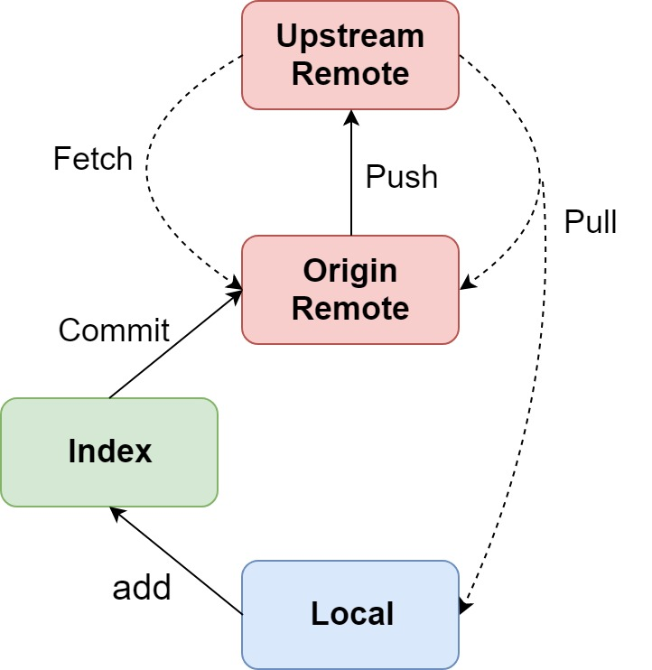

* content
{:toc}

[우아한 형제들 기술 블로그](http://woowabros.github.io/experience/2017/10/30/baemin-mobile-git-branch-strategy.html)를 참조하여 작성된 글입니다.

또한 `GitFlow`에 대해 알아가는 와중에 쓴 글이기 때문에 틀린 점이 있을 수 있습니다.

## 개요
`GitHub`는 오픈소스와 여러가지 프로젝트를 위한 협업, 코드 관리를 도와주는 편리한 플랫폼이다.

현재 공동으로 진행하는 프로젝트는 없지만, 예전에 `GitHub`를 사용하지 않았을 때 랩탑과 PC에서 번갈아가며 수정하던 프로젝트를 관리하기가 힘들었던 기억이 있다.

하지만 `GitHub`를 사용하기 시작하면서 `push`와 `pull`만 제대로 해주면 이런 문제점이 없어졌다.

또한 진행하다가 버린 프로젝트나 오랫동안 쓰지 않던 프로젝트를 찾을 때도 `GitHub`로 프로젝트를 관리한다면 쉽게 찾을 수 있다는 것이 마음에 들었다.

## Git Repository의 구성
`repository`란 프로젝트를 담을 수 있는 장소이다.

비단 프로젝트 뿐만 아니라 이미지, 비디오, 텍스트 등 여러가지 파일들을 담을 수 있다.

이런 `repository`는 3부분으로 구성된다.

> - Upstream Remote Repository : 실제 개발자들이 공유하는 저장소
> 
> - Origin Remote Repository : Upstream Repository를 Fork한 원격 개인 저장소
> 
> - Local Repository : 컴퓨터(로컬)에 저장되는 개인 저장소

